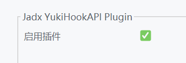
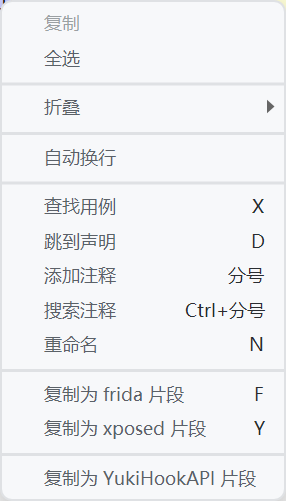

## JADX YukiHookAPI plugin

为 Jadx 添加 YukiHookAPI 支持

Add YukiHookAPI support for Jadx

目前仅支持Kotlin ,有想法可以进行PR

urrently, only Kotlin is supported. If you have any ideas, you can perform PR

## API

[YukiHookAPI](https://highcapable.github.io/YukiHookAPI)

[KavaRef](https://highcapable.github.io/KavaRef)

